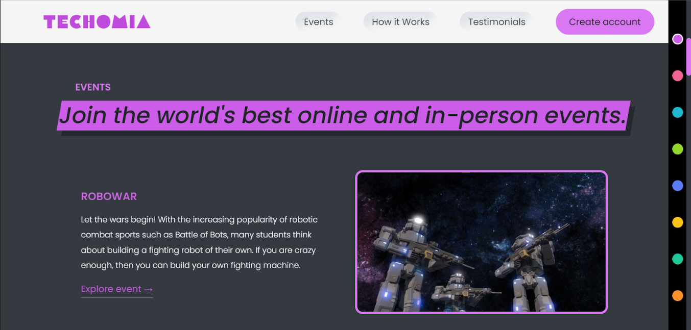

# TECHOMIA

Unleashing complexities of Event Handling !

## DESCRIPTION:

At TECHOMIA, we believe there is a better way to do event handling, a more valuable, less invasive way where organizations and universities are earned rather than bought. We are obsessively passionate about it. The Novelty associated with TECHOMIA is that our website is inexhautible. It cannot be used for organising just single event/fest instead can be used to organise multiple events/fest round the year by client organization.

## SCREENSHOTS:

### Hero Section

### Create Account Popup

### Events Section

### Event Popup

### User Events

### How it Works Section

### Testimonial Section

### Globe

### Footer

### Contact Us

### Terms of Use

## FRONTEND FEATURES:

1. ### UI/UX DESIGN:

   All aspects of the design are clear and thoughtful in terms of functionality as well as aesthetic appeal both in terms of colour schemes and how
   they are visually organized from eachother,which helps users find what they are looking for faster and more conveniently.

2. ### LAYOUT

   Website layout is the careful arrangement of visual elements on web pages using HTML5 markup languages ​​and CSS style sheets. Interactive elements are created using JavaScript programming language.

3. ### Internet Marketing:

   Internet marketing is in close contact with front-end development as closely as possible. It is through the visual design and functionality of the site that the marketer leads the client to a purchase or a key action.Internet marketing is one of the most important aspects of our website because any design and appearance is focused on attracting customers.

4. ### JavaScript programming:

   JavaScript is a language that can be embedded in HTML and run automatically when you visit your favorite websites. Unlike other languages ​​such as Java or C# (C Sharp), it doesn’t need to be compiled before running, as JavaScripts are distributed on the web as plain text without any special preparation, which means they are quite fast and easy to use.

5. ### Responsiveness:
   Responsiveness is the ability for a website to adapt the disposal of its content according to the reader’s device. For instance, you won’t see this article the same way if you read it on your smartphone and on your desktop.The responsiveness of a web app helps to display content precisely and improves readability and user experience.Our website is responsive till 600 px.

## BACKEND FEATURES:

1. ### Feature-1

   Rest server written in node.js for authentication and events management.

2. ### Feature-2

   Admin API for creating the events

3. ### Feature-3

   API coverage: User Registration, Authentication , Event Creation (Admin side), Events Registration and Management

4. ### Feature-4

   JWT auth (for authentication)

### HOSTED URL: *https://techomia.netlify.app/*

### TECHNOLOGIES USED:

**HTML**  
 **CSS**  
**JAVASCRIPT**  
 **NodeJS**  
**Express.js**  
 **PostgreSQL**

### LOCAL SETUP FOR FRONTEND:

1. [**Download Code**](https://github.com/chinmay-gupta-2003/Webkriti_Frontend-2022/archive/refs/heads/master.zip)

2. **Run on Local host** , [_Live Server Extension_](https://marketplace.visualstudio.com/items?itemName=ritwickdey.LiveServer)

### LOCAL SETUP FOR BACKEND:

> [**Backend readme.md**](https://github.com/chinmay-gupta-2003/Webkriti_Backend-2022/blob/master/readme.md)

### TEAM-MEMBERS:

1. _CHINMAY GUPTA :- 2021-IMT-023_
2. _KARUNA SINGHAL :- 2021-IMT-049_

